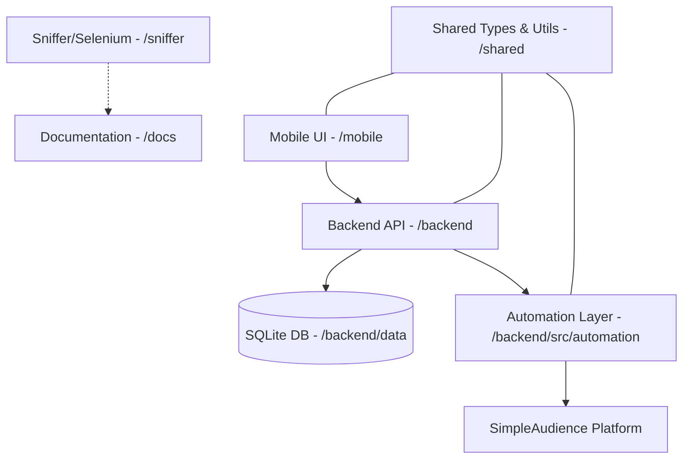

# SimpleAudience Mobile - Infrastructure Map

This document provides a comprehensive mapping of the repository structure, components, and data flow to enable full codebase understanding by AI agents.

## 🏗 High-Level Architecture

The project is a monorepo organized into specialized workspaces. It follows a classic **Frontend-Backend-Shared** architecture with an additional **Automation/Sniffer** layer for data extraction.

---

## 📁 Workspace Breakdown

### 📱 `mobile/` (Next.js Application)
*   **Role**: Primary user interface. Mobile-first, responsive React app.
*   **Key Directories**:
    *   `src/app/`: Next.js App Router (pages: `/`, `/create`, `/audiences/[id]`).
    *   `src/components/`: Modular UI elements (filters, charts, layouts).
    *   `src/const/`: UI-side constants, including local `taxonomy.ts`.
    *   `src/hooks/`: Data fetching via SWR.
    *   `src/services/`: API client interacting with the backend.

### ⚙️ `backend/` (Node.js/Express Server)
*   **Role**: Automation engine, API provider, and data persistence layer.
*   **Key Directories**:
    *   `src/api/`: REST endpoints (`routes.ts`).
    *   `src/automation/`: Puppeteer-based state machine for interacting with SimpleAudience.
    *   `src/services/`: Business logic (AudienceService, DatabaseService).
    *   `src/utils/`: XPath helpers and logger.
    *   `data/`: Persistent storage (`simpleaudience.db`).

### 📦 `shared/` (Common Resources)
*   **Role**: Source of truth for types and cross-workspace logic.
*   **Key Directories**:
    *   `types/`: TypeScript interfaces for audiences, API requests, and automation data.
    *   `taxonomy/`: The primary `filter-taxonomy.ts` (JSON-like structure defining all available audience filters).
    *   `utils/`: Shared validators and formatters.

### 🤖 `automation/` & `sniffer/`
*   **Role**: Specialized tools for data cataloging and platform API analysis.
*   **Key Elements**:
    *   `automation/src/catalog/`: Button rosters and mapping scripts.
    *   `sniffer/selenium/`: Scripts for extracting API traces and DOM structures from providers.

---

## 🗺 Key Source of Truth Files

| File | Purpose |
| :--- | :--- |
| [`shared/taxonomy/filter-taxonomy.ts`](file:///Users/ShawCole/SimpleAudienceMobile/shared/taxonomy/filter-taxonomy.ts) | **The Master Taxonomy**. Defines all categories, labels, and indices for filters. |
| [`mobile/src/const/taxonomy.ts`](file:///Users/ShawCole/SimpleAudienceMobile/mobile/src/const/taxonomy.ts) | UI-optimized taxonomy constants (simplified arrays for seniorities, industries, etc.). |
| [`docs/audience_filter_options_grouped.md`](file:///Users/ShawCole/SimpleAudienceMobile/docs/audience_filter_options_grouped.md) | Human-readable (and AI-parseable) documentation of all filter options. |
| [`backend/src/utils/selectors.ts`](file:///Users/ShawCole/SimpleAudienceMobile/backend/src/utils/selectors.ts) | XPath expressions used by the automation engine to navigate SimpleAudience. |

---

## 🔄 Data Flow & State Management

1.  **Creation**: User builds filters in `mobile`. Request hits `backend/api/audiences`.
2.  **Persistence**: `backend` saves initial metadata to SQLite.
3.  **Automation**: `SimpleAudienceClient` (Puppeteer) initiates the browser flow using the shared taxonomy to select correct options.
4.  **Updates**: UI polls `backend` via SWR; `backend` updates status as automation progresses.

---

## 🛠 Tech Stack Details
*   **Runtime**: Node.js (v20+ managed by Volta/NVM).
*   **Styling**: Tailwind CSS (for mobile components).
*   **Automation**: Puppeteer Stealth + Selenium.
*   **Database**: SQLite via `better-sqlite3`.
*   **Validation**: Zod (backend) & shared TypeScript interfaces.
